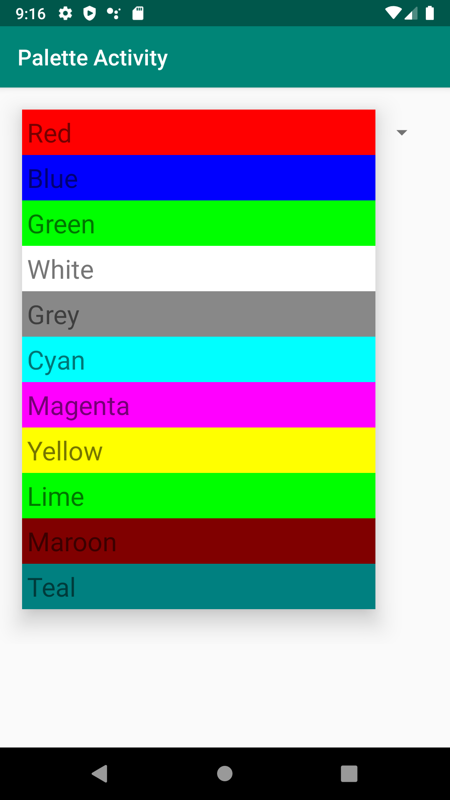
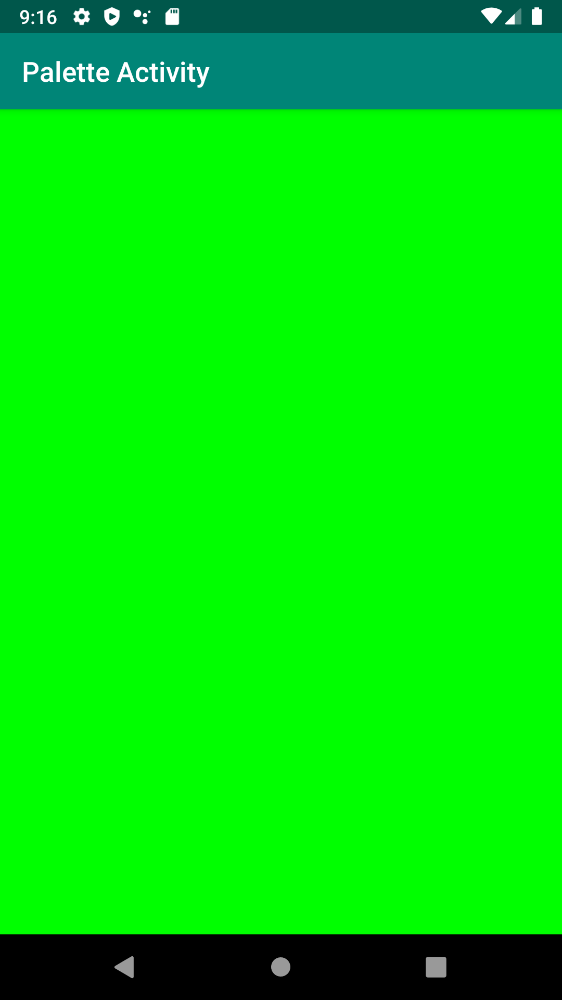

# PaletteActivity

When selecting a color from an adapter view (the Spinner) in the palette fragment, and once selected, the information should be passed to the second fragment 
that will set its background to the selected color as the following pictures:

